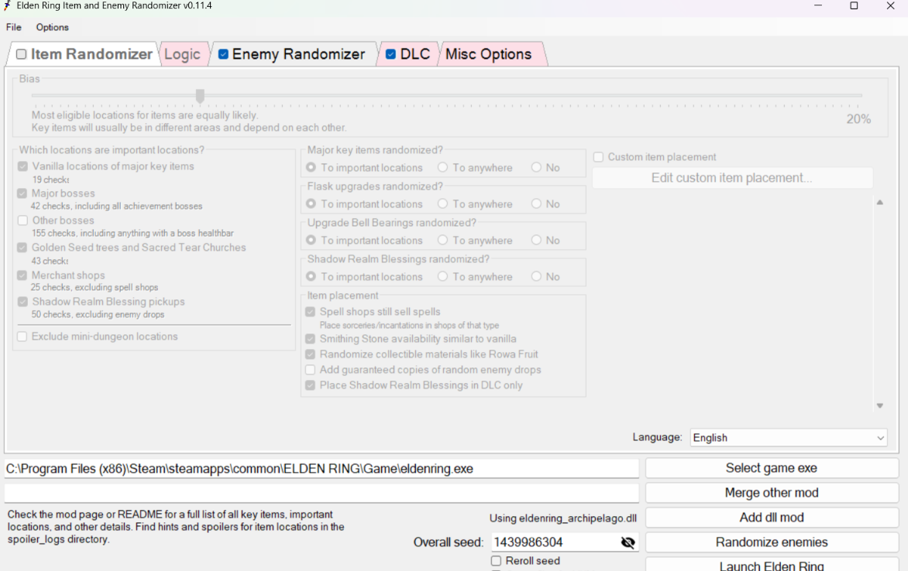
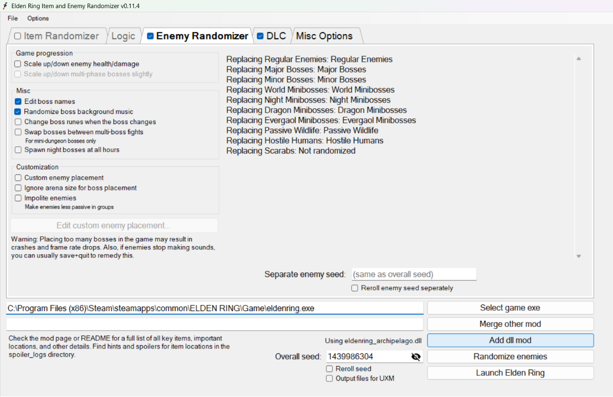
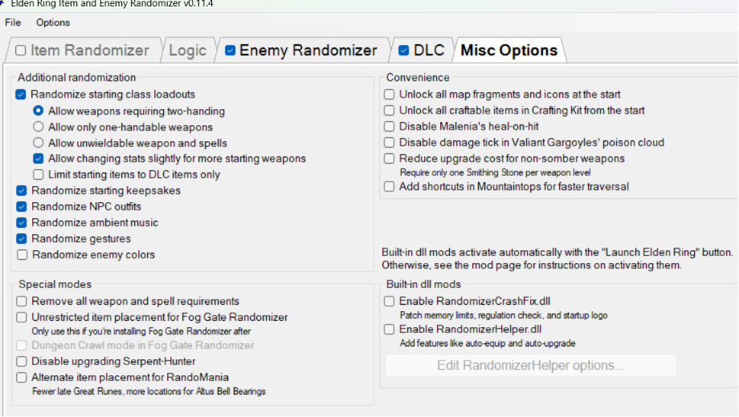
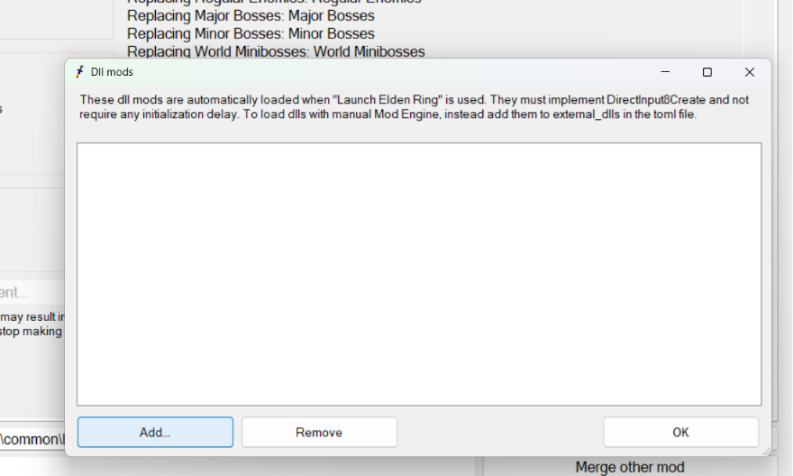
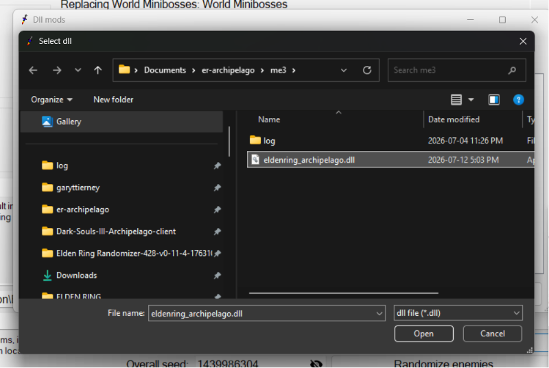
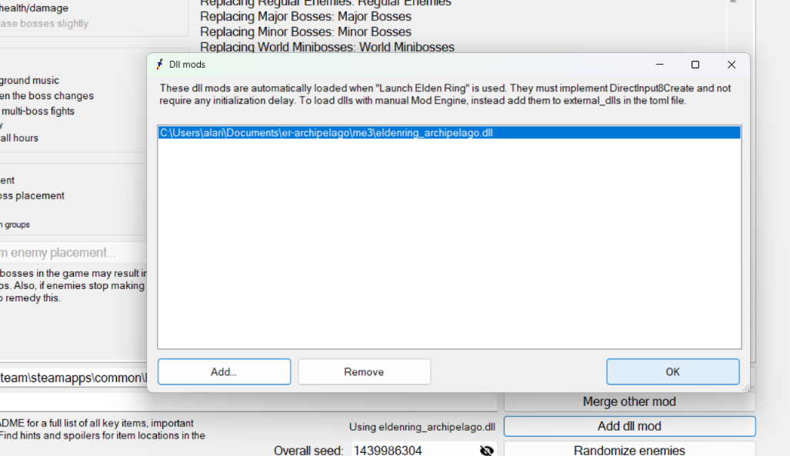
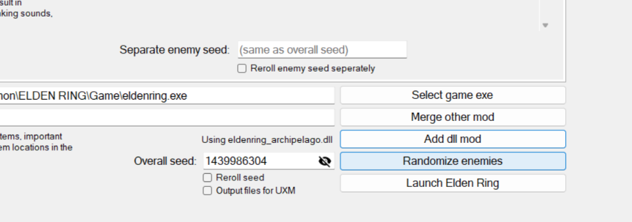
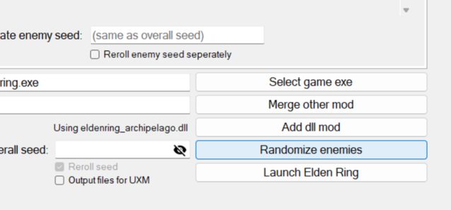

# Enemy and Starting Class Randomization -- Use matt's Randomizer. They Stack.

The short answer: this project does not randomize enemies or starting
classes, and it has no plans to -- because you can already have both,
**on top of your Archipelago seed**, by running **thefifthmatt's Elden Ring
Randomizer** alongside it. The two tools compose cleanly. You do not have
to choose.

matt's randomizer is excellent and long-established; enemy shuffle and
starting-class randomization are its territory, and it does them better
than we would by duplicating them. So instead of an apology, here is the
recipe.

One rule before anything else, because it is the only way to get this
wrong: **in matt's randomizer, ITEM randomization must be OFF.** Items are
this project's job. Enemies and starting class are matt's.

## Get it from the author

**Elden Ring Item and Enemy Randomizer** -- thefifthmatt: <https://www.nexusmods.com/eldenring/mods/428>

Download it from that page and nowhere else. We deliberately do **not** bundle it, mirror it,
or ship any of its files: matt's terms ask that the randomizer and its config files not be
redistributed, and that is a request worth honouring. Linking you to the source is both the
correct thing and the safer thing -- you get the current version, with his install notes.

## The recipe: randomized enemies + starting class + Archipelago

1. **Generate your Archipelago seed** as usual (see
   [SETUP.md](SETUP.md), part A). Nothing about it changes.
2. **Run matt's Elden Ring Randomizer** and configure it:
   - Enemy randomization: **ON** (bosses too, if you like).
   - Starting-class randomization: **ON**, if you want it.
   - Item randomization: **OFF**. This is the critical one -- see the
     settings section below.
3. **Let matt's randomizer write its output** the way its own
   instructions describe. It works by rewriting the game's files
   (`regulation.bin` and friends).
4. **Launch the game with the Archipelago runtime client loaded**
   (see [SETUP.md](SETUP.md), part B) and connect to your seed.
5. **Play.** Enemies and your class come from matt's seed; every item
   pickup is still an Archipelago check, and Region Locks still arrive
   from the multiworld.

## Recommended matt's randomizer settings

Paste this into matt's randomizer (**Options -> Set options from string**):

```
bossbgm changestats dlc dlckeysilo earlylegacy earlymedal editnames enemy racemode_health racemode_key racemode_scadu racemode_upgrades v15 bias:0
```

**Note there is no `seed:` on the end.** That is deliberate. A blank seed box means the
randomizer rolls a fresh seed for you when you click **Randomize enemies** -- you get your own
enemy layout, not ours. If your seed box is not blank, clear it.

(With the box empty, matt's ticks "Reroll seed" for you and greys it out. You do not have to do
anything.)



**Read the tabs in that picture.** `Item Randomizer` is **unticked** and its entire panel is
greyed out. `Enemy Randomizer` and `DLC` are ticked. That is the configuration that matters, and
it is the one thing you must not get wrong.

The string contains tokens like `racemode_key` and `raceloc_shops`, which look alarming -- they
are item-randomizer settings. They are **inert**: they are just the item tab's remembered state,
and the item randomizer is off (there is no `item` token in the string). Do not let them tempt
you into ticking the Item Randomizer box.



### Then check **Misc Options** -- this is where the starting class lives

Starting-class randomization is **not** part of the Item Randomizer. It sits in the **Misc
Options** tab, which is why you still get it with items off.

Open Misc Options and make sure it looks like this:



The one that matters is **Randomize starting class loadouts**. The others in that group
(starting keepsakes, NPC outfits, ambient music, gestures) are taste -- turn them off if you
would rather they stayed vanilla.

**Tick it by hand if it is not already ticked.** We are not certain the options string carries
these Misc boxes with it, so do not assume the paste did it for you. Ten seconds of looking
beats starting a run as a vanilla Wretch when you were promised a random class.

## Load the Archipelago client through matt's launcher

You do not run two launchers. matt's randomizer will load our client for you as a dll mod, and
launch the game with both active.

1. Click **Add dll mod**.

   

2. **Add...** and pick `eldenring_archipelago.dll` (it lives in the `me3` folder of your
   Archipelago client install).

   

3. It should now be listed, and the main window should read **"Using eldenring_archipelago.dll"**.

   

4. Click **Randomize enemies**.

   

5. Check the **Overall seed** box is **blank**, then **Launch Elden Ring**.

   

The game starts with matt's enemy randomization baked into the files, and our client running in
memory on top of it. Connect to your Archipelago room as usual.


## Why this composes at all

The two tools do different jobs in different places:

- **matt's randomizer** rewrites the game's files on disk --
  `regulation.bin` and related data -- before you play.
- **This project** is pure-runtime. It modifies **no game files**: it
  reads and writes params in memory while the game runs, through the
  runtime client. Remove the client and your install is exactly as
  matt's randomizer left it.

Because we are not fighting over the same bytes on disk, the two coexist
-- with the one overlap being items, which is why matt's item
randomization must stay off. The projects share no code or data; v0.2 is
a from-scratch, data-derived rebuild. We recommend matt's randomizer
because it is good, not because we depend on it.

## "reroll_enemy_drops" is not enemy randomization

One shipped option (on by default) has a misleading name, so let's be
plain about it: **`reroll_enemy_drops` changes what farmable enemies
drop** -- the repeatable farm drops -- not which enemies exist or where
they stand. Their one-time drops, the actual Archipelago checks, are
untouched. No enemy moves, changes, or gets replaced. It reshapes the
farming economy, nothing more.

Relatedly: **enemy and boss scaling is always on** and keyed to your
progression -- a region you unlock late is tuned tougher, even "early"
territory. That is scaling, not randomization; the enemies are still
whatever your game (vanilla or matt-shuffled) puts there.

## What this project randomizes instead

- **The item and check layer.** Every item pickup -- corpse loot, chests,
  boss drops, shop slots -- is a check that pays out a shuffled item,
  possibly another player's, in a multiworld.
- **The progression graph itself, via `num_regions`.** The open world is
  carved into regions sealed behind Region Lock items you must *receive*
  from the multiworld; each Lock that arrives opens a region. This is
  the marquee feature -- it turns Elden Ring's go-anywhere map into an
  Archipelago progression puzzle.

For the full mental model of how a run plays, see the
[Player Guide](Elden-Ring-Archipelago-Player-Guide.md).

## See also

- [SETUP.md](SETUP.md) -- installing and generating a seed.
- [Player Guide](Elden-Ring-Archipelago-Player-Guide.md) -- how a run
  actually plays, start to finish.
- [KNOWN-ISSUES.md](KNOWN-ISSUES.md) -- current issues and by-design
  non-features.
