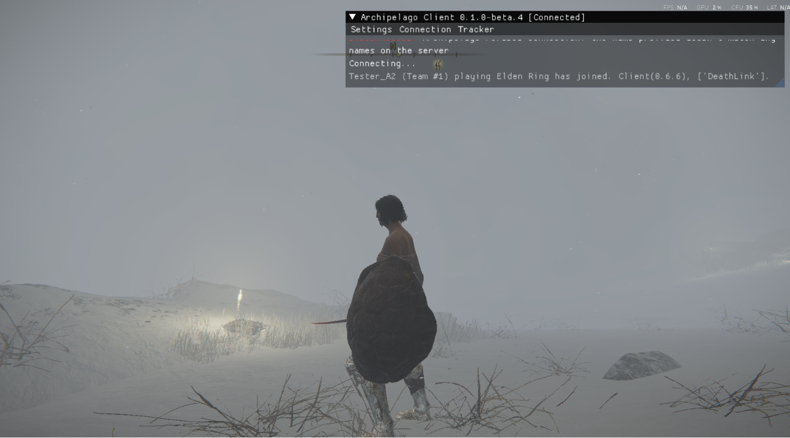

# Elden Ring Archipelago -- Setup (v0.2)

This gets you from nothing to a running seed in about 15 minutes. Two halves:
**A. Make the seed** (Archipelago side) and **B. Install and play** (game side).

New to Archipelago? It is a **multiworld** randomizer platform: one or more
games are shuffled together, and items you find in your game can belong to
someone else's -- and theirs to you. It works solo too, and a solo base-game
run is the recommended way to play v0.2. Each player in a multiworld occupies
a **slot**, configured by a **yaml** -- a plain-text settings file.

The recommended v0.2 configuration is **The Shattering**, solo, base game only
(DLC is off by default): the Lands Between is broken into regions, and each
region's key arrives as a randomized item. The included `EldenRing.yaml` is
already set up for it. Change `name:` and you have a valid seed.

---

## Upgrading from v0.1? Read this first.

**The game id changed.** In v0.1 the game was called `EldenRing`; in v0.2 it is
**`Elden Ring` -- with a space**. A v0.1 yaml will be rejected at generation
with:

```
No world found to handle game EldenRing. Did you mean 'Elden Ring'?
```

If you see that message, you are feeding v0.2 a v0.1 yaml.

**Do not fix an old yaml by hand -- start from the shipped `EldenRing.yaml`.**
v0.2 cut the option surface down to 19 tunable options. Archipelago **warns**
about each option it does not recognize and then **generates the seed anyway**,
on defaults -- so an edited v0.1 yaml still gives you a game you did not
configure; the only sign is a line in the generation output. Copy the new file
and re-apply your choices there. (If you do reuse an old yaml, read the
generation output: every dropped option is named.)

**Mid-run on a v0.1 seed?** Because the game id changed, the v0.1 and v0.2
worlds can be installed side by side. You can finish your v0.1 seed first, no
rush.

---

## What's in this release

| File | What it is |
|---|---|
| `eldenring.apworld` | The Archipelago world -- the package that teaches Archipelago about Elden Ring. Goes in your Archipelago install. |
| `eldenring_archipelago.dll` | The runtime client (MIT) that talks to the live game. Loaded via ModEngine3, or via matt's launcher. |
| `EldenRing.yaml` | The player config template (The Shattering). Copy it, set `name:`, generate. |
| `SETUP.md` | This file. |
| `RELEASE-NOTES-v0.2.md` | What this project is and what v0.2 brings, in one read. |
| `CHANGELOG.md` | What changed in v0.2, including both breaking changes. |
| `KNOWN-ISSUES.md` | Current known issues and by-design non-features -- read it before filing a report. |
| `Elden-Ring-Archipelago-Player-Guide.md` | How a run actually plays once you press New Game. |
| `ENEMY-AND-STARTING-CLASS-RANDOMIZATION.md` | Stacking matt's randomizer for enemies and starting class (with items OFF). |
| `ATTRIBUTION.md` | Credits, licensing, and provenance. |
| `DISTRIBUTION.md` | How this release is packaged, and why the apworld and `.dll` must come from the same tag. |
| `SCREENSHOTS.md` | Index of the screenshots and what each one shows. |
| `screenshots/` | The images (10 PNGs) the docs above reference. |
| `LICENSE` | The MIT license text. |

You also need, separately:

- **Elden Ring** on PC (Steam). **We** bake nothing into the game files: no
  `regulation.bin` edit, no file patching. Everything this randomizer does
  happens at runtime, while the game runs.

  That is also why it **stacks with thefifthmatt's Elden Ring randomizer**. If
  you want randomized enemies or a randomized starting class, run matt's for
  those and play your Archipelago seed on top -- with **item randomization
  turned OFF in matt's**, since that part is our job. See
  `ENEMY-AND-STARTING-CLASS-RANDOMIZATION.md`.
- **Archipelago 0.6.7** -- download from [archipelago.gg](https://archipelago.gg).
  This release requires 0.6.7 specifically.
- **ModEngine3 (me3)** -- the mod loader that loads the client into the game.

---

## A. Make the seed (Archipelago side)

1. **Install the apworld.** Double-click `eldenring.apworld` so Archipelago
   registers it, *or* drop it into `Archipelago/custom_worlds/`. Either way,
   you should end up with `eldenring.apworld` sitting in
   `Archipelago/custom_worlds/`.

2. **Add your config.** Copy `EldenRing.yaml` into `Archipelago/Players/`.
   Open it and set `name:` to the slot name you want. That is the only edit
   you need -- the defaults are a tuned solo Shattering run. Leave
   `game: Elden Ring` and the `Elden Ring:` section header exactly as they
   are (the options must stay indented under it).

   Want to tweak? Every option is explained in a comment right next to it in
   the yaml. `KNOWN-ISSUES.md` lists the by-design no-ops.

3. **Generate.** Run **Generate** from the Archipelago Launcher (or
   `ArchipelagoGenerate`). When it works, an `AP_<...>.zip` appears in
   Archipelago's `output/` folder. If it fails naming the game `EldenRing`,
   see the upgrade section above.

4. **Host it.** For a solo game, host the zip locally with the Archipelago
   server in the same install. For a multiworld, upload it to
   [archipelago.gg](https://archipelago.gg) and note the **room address** and
   **port** -- you will enter them in-game in part B.

---

## B. Install and play (game side)

1. **Install ModEngine3.** Follow its own install instructions until the
   `me3` launcher works.

2. **Drop in the runtime client.** Put `eldenring_archipelago.dll` where your
   ModEngine3 profile loads it, and launch Elden Ring through ModEngine3. When the
   client is loaded, its overlay **menu bar** is visible in-game.

   **Also running matt's randomizer?** Then you do not launch twice. Add
   `eldenring_archipelago.dll` to matt's **Add dll mod** list and use his
   **Launch Elden Ring** button -- it loads our client for you. Full walkthrough,
   with pictures, in `ENEMY-AND-STARTING-CLASS-RANDOMIZATION.md`.

3. **Connect.** Open the **Connection** entry in the overlay menu bar and
   enter your server address, slot name, and password. (Solo local game:
   the address is `localhost` plus the port your server printed.) If you kept
   an `apconfig.json` from v0.1, it still works:

   ```json
   {"url":"localhost:38281","slot":"YourName","seed":"","client_version":null,"password":null}
   ```

   Open the overlay from a menu, not while moving, so stray keys don't leak
   into the game.

   **This is what "it worked" looks like.** The overlay title reads
   **[Connected]**, and the log line names your slot and the game:

   

   `Tester_A2 (Team #1) playing Elden Ring has joined.`

   Note the game name in that line: **`Elden Ring`**, with the space. If you see
   a refused connection instead, the two usual causes are a slot name that does
   not match the one in your yaml, and the wrong port.

4. **Play.** In The Shattering you begin at Roundtable Hold with one region
   already open. Find a region's Lock, fast-travel in, clear its checks, and
   work toward the goal region. Received items appear in the game's own
   bottom-center event banner; every check you find is sent to the server.

   One thing to internalize before you start: **Region Locks are the only way
   into a region.** When a Lock arrives, that region's graces light up and
   you warp in. Vanilla key items and routes gate nothing -- no Rold
   Medallion for the Mountaintops, no Mohg fight for the DLC -- and entering
   a region whose Lock you don't hold gets you warped back out. The Player
   Guide covers this model (and its two vanilla-flavored exceptions) in
   detail.

### Handy in-game tools

- **Tracker** -- press **F6** or use the **Tracker** entry in the overlay menu
  bar. Shows your checks grouped by region with done/total, dims locked
  regions and names their gate item, and highlights your current region.
- `/warp <id>` -- teleport (e.g. into a freshly unlocked region if a grace
  hasn't lit yet).
- **Connection** -- re-enter server / slot / password any time, even while
  connected, to switch rooms.

---

## Variants

The defaults are the recommended run. If you want to stray:

- **Shorter runs:** the shipped `num_regions: 0` keeps every eligible region
  in play (the full Shattering: 17 base-game regions as shipped, 31 with the
  DLC on); set a small number like `4` for a tight evening run.
- **Fixed vs random path:** `num_regions_order: spine` (default) keeps a fixed
  early path (Limgrave first); `rolled` keeps random regions.
- **Great-Rune goal:** `ending_condition: great_runes` +
  `great_runes_required: N`.
- **DeathLink:** `death_link: true` -- shared deaths in a multiworld, both
  directions.
- **DLC (experimental):** `enable_dlc: true` (DLC regions become eligible) or
  `dlc_only: true` (only the Land of Shadow). DLC regions unlock exactly like
  base ones -- their Lock arrives and you warp in; you never fight Mohg
  first. Base game is the recommended, supported way to play v0.2 -- see
  `KNOWN-ISSUES.md` for DLC caveats.

---

## If something went wrong

**`VERSION MISMATCH` in the client log.**
Your apworld and your client `.dll` are from different builds. The game will
still boot and connect, and then behave subtly wrong -- the client reads
`slot_data` in shapes the apworld isn't sending. **Redownload both from the same
release tag.** Do not report bugs from a mismatched pair; they won't be real.
(In a multiworld this can also mean the *host* generated with a different apworld
version than your client expects -- ask them which release they used.)

**"No world found to handle game EldenRing. Did you mean 'Elden Ring'?"**
You generated with a v0.1 yaml. The game id is now `Elden Ring`, with a
space. Do not just edit the `game:` line -- start over from the shipped
`EldenRing.yaml`. Archipelago warns about old option names but generates
anyway, so your v0.1 settings would be dropped and the seed would still build.

**The seed generated fine, but the game ignores settings I set.**
Almost certainly a hand-edited old yaml. Unknown options are silently
ignored, and v0.2's option surface (19 tunable options) is much smaller than
v0.1's. Regenerate from the shipped `EldenRing.yaml`.

**Generation fails, or the apworld won't load, and it isn't the game-id message.**
Check your Archipelago version: this release requires **0.6.7**. Also confirm
`eldenring.apworld` is in `Archipelago/custom_worlds/`.

**The game launches but there's no overlay / nothing connects.**
The client isn't loaded. Make sure you launched Elden Ring through
ModEngine3, that `eldenring_archipelago.dll` is where your me3 profile loads
it. And make
sure the game files are in a state you expect. A vanilla install always works;
matt's randomizer alongside it is supported (items OFF). Other mods that rewrite
item lots or params are not.

Still stuck, or a seed looks broken? Bring your yaml and the spoiler log when
you ask for help.
